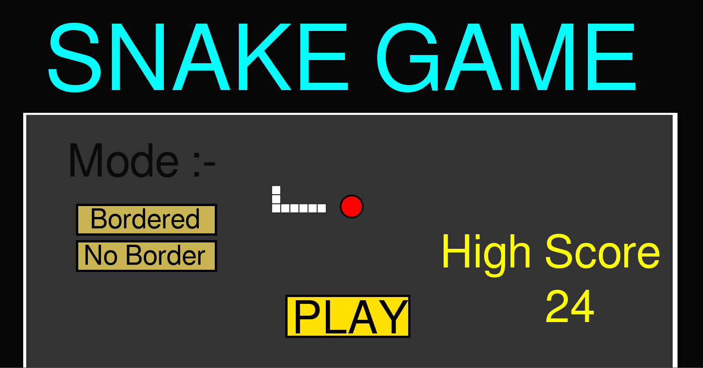
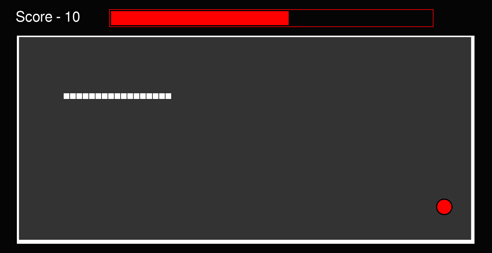
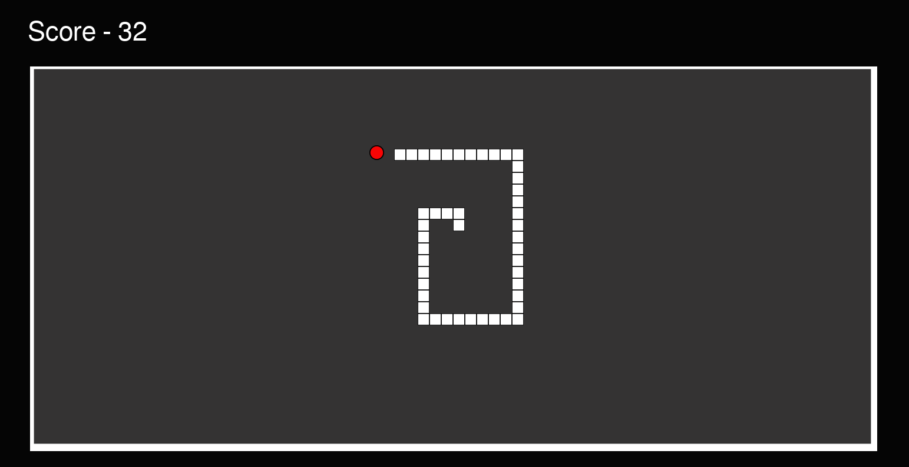
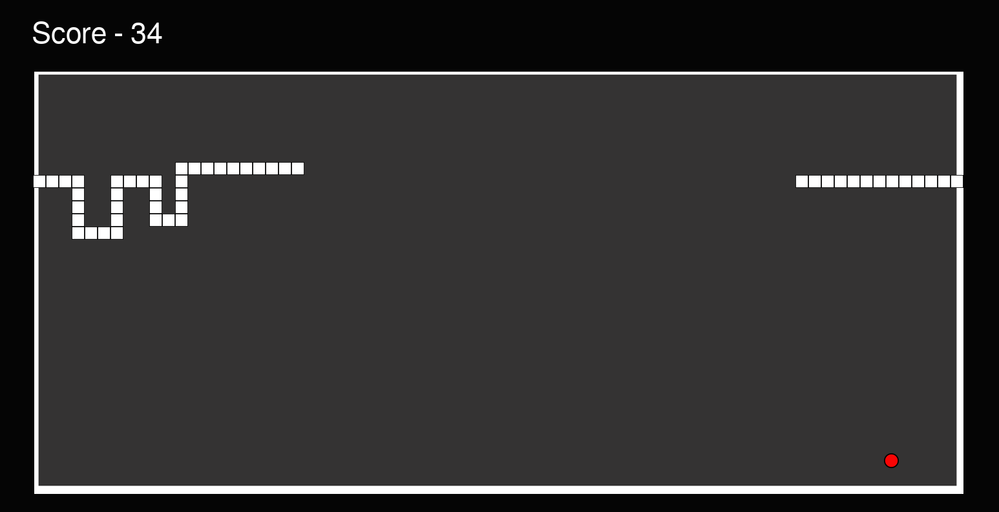

# 🐍 Snake Game

A classic Snake game built from scratch in Python using Pygame, featuring smooth animations, two game modes, a high score system, and a polished welcome screen.

---

## 📸 Screenshots

| Welcome Screen | Gameplay |
|:-:|:-:|
|  |  |
|  |  |

---

## 🎮 Features

- **Two Game Modes** — Choose between *Bordered* (walls kill you) and *No Border* (wrap around the edges)
- **Two Point Types** — Small points worth 2 points spawn regularly; every 5th pickup is a large point worth 10, with an animated countdown timer bar
- **Animated Sprites** — The small point cycles through 4 frames; the timer bar pulses with 8 animation states
- **High Score Persistence** — Your best score is saved to disk and displayed on the welcome screen
- **Resizable Window** — The game window supports dynamic resizing via Pygame's `RESIZABLE` flag
- **Custom Icon & Assets** — Custom logo, background, play area, snake, and point sprites

---

## 📁 Project Structure

```
Snake-Game/
├── main.py              # Main game logic
├── requirements.txt     # Python dependencies
├── logo.ico             # Window icon
├── .python-version      # Python version pin
├── bin/
│   ├── high_score.txt   # Persisted high score
│   └── mode.txt         # Persisted game mode selection
└── gallery/
    ├── Screenshots/
    │   ├── Welcome.png
    │   ├── Gameplay1.png
    │   ├── Gameplay2.png
    │   └── Gameplay3.png
    ├── background.png
    ├── play_area.png
    ├── snake.png
    ├── small_point_1.png
    ├── small_point_2.png
    ├── small_point_3.png
    ├── small_point_4.png
    └── large_point.png
```

---

## 🚀 Getting Started

### Prerequisites

- Python 3.x (see `.python-version` for exact version)

### Installation

```bash
# Clone the repository
git clone https://github.com/harshk-dev/Snake-Game.git
cd Snake-Game

# Install dependencies
pip install -r requirements.txt
```

### Run the Game

```bash
python main.py
```

---

## 🕹️ Controls

| Action       | Keys                          |
|--------------|-------------------------------|
| Move Up      | `W` / `↑` / `8` (numpad)     |
| Move Down    | `S` / `↓` / `2` (numpad)     |
| Move Left    | `A` / `←` / `4` (numpad)     |
| Move Right   | `D` / `→` / `6` (numpad)     |
| Quick Start  | `Space` (from welcome screen) |
| Quit         | `Escape`                      |

---

## 📊 Scoring

| Event             | Points |
|-------------------|--------|
| Small point       | +2     |
| Large point       | +10    |

Every 5th point pickup spawns a large point with a ticking timer bar — collect it before the bar fills up or it resets!

---

## 🔧 How It Works

The game is structured around four core phases:

1. **`welcome_screen()`** — Displays the title, high score, mode selection buttons, and a PLAY button. Mode choice is persisted to `bin/mode.txt`.
2. **`main_game()`** — The main game loop handling movement, point spawning/collection, timer bar animation, and collision detection.
3. **`snake_death()`** — Briefly flashes the snake on death before returning to the menu.
4. **`hig_score()`** — Compares the current score against the stored high score and updates it if beaten.

Collision and movement logic is split across dedicated helpers: `snake_movement()`, `border_collision()`, `collision()`, `score_checker()`, and `no_border_mode()`.

---

## 🛠️ Built With

- [Python](https://www.python.org/)
- [Pygame](https://www.pygame.org/)

---

## 👤 Author

**Harsh Kumar** — [@harshk-dev](https://github.com/harshk-dev)
